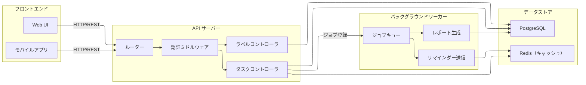
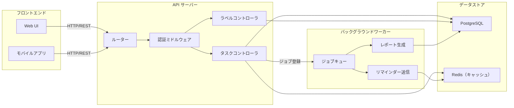
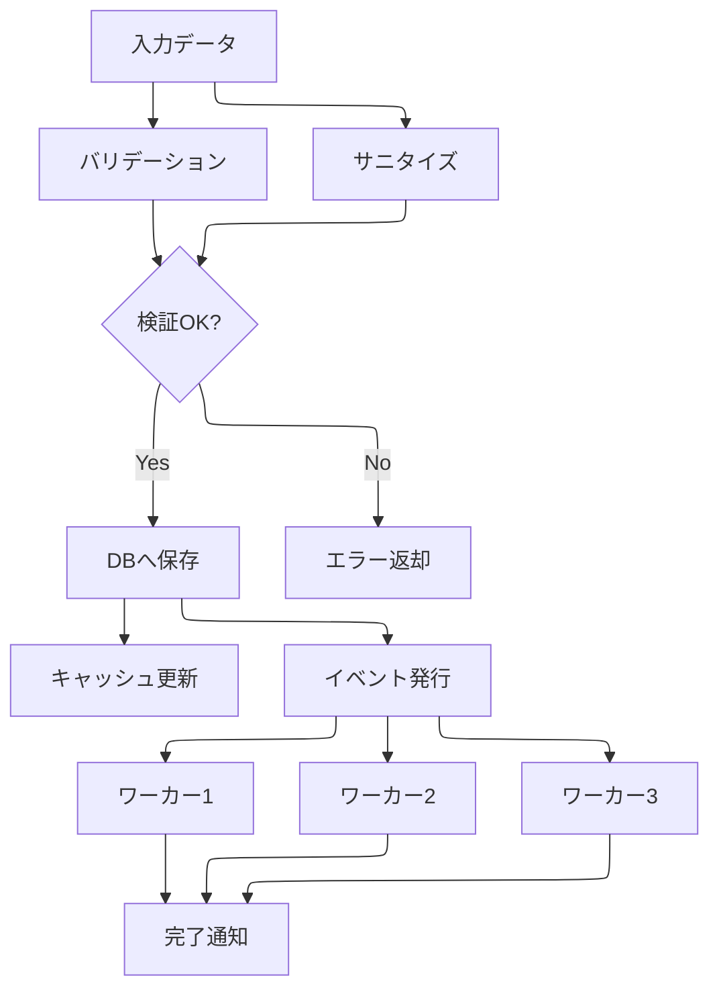

# ELK レンダリング テスト

mermaid の `%%{init: {'flowchart': {'defaultRenderer': 'elk'}}}%%` ディレクティブで ELK レイアウトエンジンを有効化します。

---

## 1. ELK あり（複雑なフローチャート）

%%{init: {'flowchart': {'defaultRenderer': 'elk'}}}%%

---

## 2. ELK なし（同じ構造、dagre デフォルト）

---

## 3. ELK + TB（上から下、ポート割り当てが顕著）

